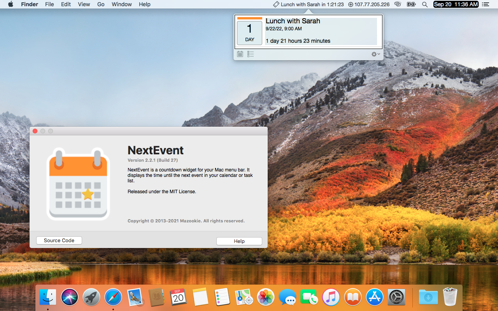

# NextEvent 

NextEvent is a countdown widget for your Mac menu bar. It displays the time until the next event in your calendar or reminders.

 - Choose the number of events to display, 1, 3, 5, 10, today only events or for the next 24 hours.
 - Flash icon on 15 minute warning for next event due.
 - Blocking alerts, so you don't miss an appointment.
 - Visual and audio notification.

## Screenshots

## Versions
>[2.2.3](builds/NextEvent_v2.2.3/NextEvent.zip)
>    Changes:
>    - Ventura bug fixes

>[2.2.1](builds/NextEvent_v2.2.1/NextEvent.zip)
>    Changes:
>    - First Open Source Release

## Support

**Bugs and requests?**  Please use the project's [issue tracker].

**Want to contribute?**  Please fork this repository and open a pull request with your new changes.

**Do you like it?**  Support the project by starring the repository or [tweet] about it.

## Thanks for looking!
*If you like what you see* 

**NextEvent** © 2022, Mazookie, LLC. Released under the [MIT License](LICENSE).

[tweet]: https://twitter.com/intent/tweet?
[issue tracker]: https://github.com/pawong/NextEvent/issues/new

Q: What is Mazookie?

A: Mazookie is a company that used to put apps on the MacOS App Store. This doesn't happen any more because Apple charges money to be a developer and there's no money in these apps, so the projects have been opensourced. Yeah, free stuff!
